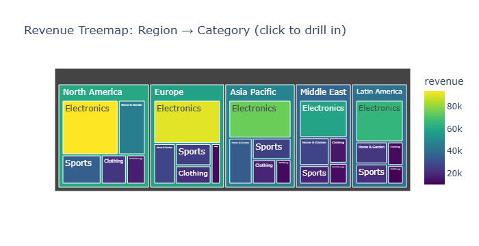

# 📊 EDA Global Sales Dashboard

> Exploratory Data Analysis on a synthetic global sales dataset spanning 2 years,
> 5 regions, 5 product categories, and 4 sales channels.

---

## 📌 Project Overview

This project performs a full EDA pipeline on 2,000 synthetic sales transactions
generated with realistic business dynamics including seasonality, regional
multipliers, discount structures, and log-normal noise.

Built as **CV Portfolio Project #3** to demonstrate proficiency in the complete
data analysis workflow — from raw data generation through to interactive
visualisation and business insight extraction.

---

## 🗂️ Repository Structure
---

## 📦 Dataset

| Property | Value |
|----------|-------|
| Rows | 2,000 transactions |
| Columns | 14 features |
| Period | Jan 2022 – Dec 2023 |
| Regions | North America, Europe, Asia Pacific, Latin America, Middle East |
| Categories | Electronics, Clothing, Food & Beverage, Home & Garden, Sports |
| Channels | Online, Retail Store, Wholesale, Direct Sales |

> No external data file needed — the dataset is generated inside the notebook.

**Revenue formula:**
---

## 🔍 Analysis Steps

| Step | Description |
|------|-------------|
| 1 | Library installation & imports |
| 2 | Synthetic dataset generation |
| 3 | Statistical summary, null check, IQR outlier detection |
| 4 | 9-panel static dashboard (Matplotlib + Seaborn) |
| 5 | Interactive scatter plot & treemap (Plotly) |
| 6 | KPI extraction & business insights |

---

## 📈 Dashboard Preview

---

## 💡 Key Business Insights

- 🏆 **Electronics** is the top revenue category due to its high base price ($800/transaction)
- 🌍 **North America** leads all regions with a 1.4× revenue multiplier
- 📅 **Mid-year (Apr–Jul)** is the peak sales period driven by seasonal demand
- ⚠️ **Discount–Margin correlation: −0.34** — higher discounts measurably compress profitability
- 🛒 **Direct Sales** channel generates the highest total revenue

---

## 🛠️ Tech Stack

| Library | Purpose |
|---------|---------|
| `pandas` | Data manipulation, groupby, datetime |
| `numpy` | Array math, random generation |
| `matplotlib` | Static multi-panel dashboard |
| `seaborn` | Heatmaps, statistical plots |
| `plotly` | Interactive scatter & treemap |
| `scipy` | Statistical functions |

---

## 📋 Requirements
---
pandas>=2.0.0
numpy>=1.24.0
matplotlib>=3.7.0
seaborn>=0.12.0
plotly>=5.0.0
scipy>=1.11.0
jupyter>=1.0.0

## 🔬 Research Questions Explored

1. Which product category generates the highest revenue?
2. How does revenue differ across geographic regions?
3. Is there seasonal variation in monthly sales?
4. Which sales channel is most profitable?
5. What is the shape of the revenue distribution?
6. How do discounts impact profit margins?
7. Do satisfied customers spend more?
8. Which variables are most strongly correlated?

---

## 🚧 Future Work

- [ ] Time series forecasting with Prophet or ARIMA
- [ ] Customer segmentation using K-Means (RFM model)
- [ ] Streamlit web dashboard deployment
- [ ] Real-world dataset integration (Kaggle Superstore)
- [ ] A/B test simulation for discount strategies

---

## 👤 Author

**Umair Ali**
[LinkedIn](www.linkedin.com/in/umair-ali99) · [GitHub](https://github.com/umairrana99)

---

## 📄 License

This project is open source under the [MIT License](LICENSE).

